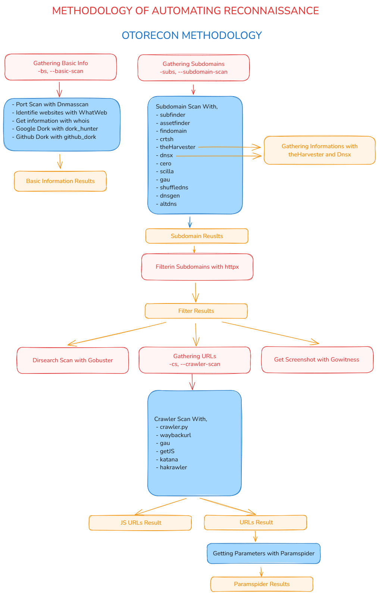

<p align="center">
  <b>The Information Gathering Tool for Bug Bounty</b>
  <br>
  <b>
    &mdash; Via, <a href="https://github.com/Mr0Wido">Mr0Wido</a>
  </b>
</p>
<p align="center">
    <a href="https://docs.python.org/3/download.html">
        
    </a>
    <a href="https://github.com/Mr0Wido/otorecon/releases">
        
    </a>
    <a href="https://github.com/Mr0Wido/otorecon/">
        
    </a>
    <a href="https://github.com/Mr0Wido/otorecon">
        
    </a>
    <a href="https://mr0wido.github.io"> 
        
    </a>
</p>

## About

Otorecon is a Python-based tool for __Reconnaissance__. It provides a variety of scanning options, including these;

- Basic Information Scan
- Subdomain Scan
- Crawler Scan
- Directory Search Scan
- Getting Screenshots

<br>

## Installation


If you are using a virtual environment, run these commands:

```bash
$ python3 -m venv venv
$ source venv/bin/activate  
```

```bash
$ git clone https://github.com/Mr0Wido/otorecon.git
$ cd otorecon
$ pip install .
```

Run these commands for installing tools:

```bash
$ sudo chmod +x install.sh
$ ./install.sh
```

## [Usage](https://github.com/Mr0Wido/otorecon/wiki/Usage)
Click the title and learn how to use __otorecon__.


## Otorecon Workflow

